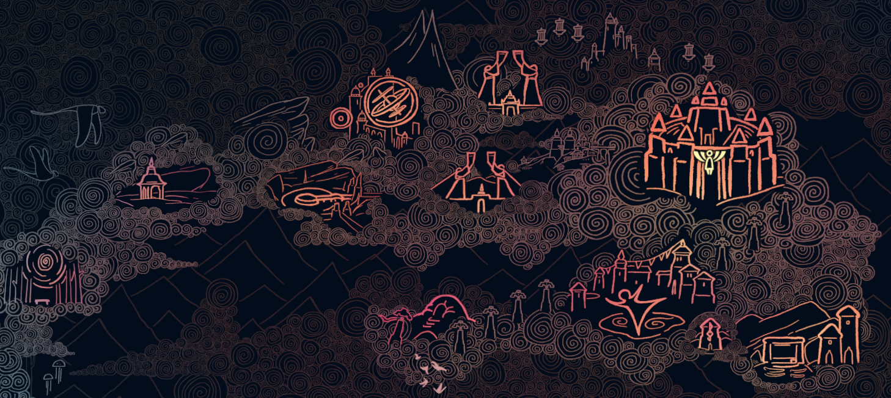

 
<h1 style="font-size:6rem;color:#e7c386;font-family:Times,serif;"> ˖° Astrolabe ✧˖°.</h1>
Sky Clock + Sky Shards, for Discord.

## Setting up

For a more general guide to creating a Discord bot, check out the [Discord.js guide](https://discordjs.guide/).

### Creating a Discord application and bot user

[This tutorial](https://discordjs.guide/preparations/setting-up-a-bot-application.html#creating-your-bot) will walk you through the process of creating a Discord application and an associated bot account.

Once your bot user is created, you will be provided with a token for it. You will only be shown this token once, so save it somewhere safe. Do not share it or merge it into a cloud-hosted code repository.

### Running Astrolabe

In the root of this project, create a `.env` file. This file is already ignored using `.gitignore`, but just in case it needs to be repeated, _do not merge this file into a cloud-hosted repository_.

Add the following lines to your `.env`:
```
DISCORD_APPLICATION_ID={your Discord application ID here}
DISCORD_PUBLIC_KEY={your Discord public key here}
DISCORD_TOKEN={your bot token here}
DISCORD_TEST_SERVER_ID={Server ID / Guild ID for your test server}
```

In your root directory, run the command:
```
npm install
```

Then, still in your root directory, run:
```
npm run start
```
The application will start. You should now see the bot as logged in on your server.

## Commands

| Command | Description |
| ------- | ----------- |
| **/shard**  | displays the next shard eruption |
| **/redshard**  | displays the next RED shard eruption |
| **/geyser**  | displays the next geyser eruption |

### WIP Commands
These commands are planned for the future, but I haven't had the chance to implement them yet.

| Command | Description |
| ------- | ----------- |
| **/today**  | displays all the supported events for today |
| **/grandma**  | displays today's grandma info |
| **/turtle**  | displays today's turtle info |
| **/about**  | links to this bot's github README |

## Code Changes

If you add, remove, or modify a command, you will need to deploy your new commands so that the Discord API knows how to handle them.

First, add the commands in the marked areas of the `index.js`, `deployCommands.js` files.

To deploy your commands for use on your personal server to test them out, use:
```
npm run deploy:test
```

Once you have thoroughly tested out your commands and are confident they are ready for usage, you can deploy them globally by running:
```
npm run deploy:global
```

## Sources & Credits
The information used in this bot was acquired from [The Sky Wiki](https://sky-children-of-the-light.fandom.com/wiki/Shard_Eruptions#Schedule), with credit to the [Sky Shards](https://sky-shards.pages.dev) squad for their investigative work tracking shard times.
